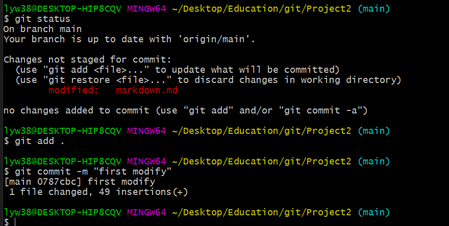

# Project2
# git
## 초기설정

**git config**를 통하여 사용자의 이름과 사용자의 이메일 등을 설정할 수 있습니다.

  
또한 **config --list**를 통하여 어떻게 설정되었는지 볼 수 있습니다. 위 사진은 user name과 user email에 위에서 입력한 대로 바르게 들어간 것을 확인 할 수 있습니다.

  
**git init**을 통하여 .git이라는 파일을 만들고 **git remote add origin *repository address***을 통해 github와 연결하여 사용할 수 있으며  
**git clone *repository address***을 통해 github 복사한 폴더를 만들어 줍니다.

  
저는 복사한 Project2파일에서 작업을 수행하도록 하겠습니다.

## Markdown 생성부터 push까지
  
빈 markdown.md파일을 생성합니다.

  
**git status**를 하면 markdown.md는 트래킹이 안되었다고 나온다  
이때 **git add**와 **git commit**을 통하여 트래킹을 해준다.

  
**git push**을 할 경우 로그인 할 창이 나오게 되는데 이 때 로그인을 하면 수정한 것이 github에 올라가게 된다. 
  
github에 올라간 모습은 위와 같다.

## first modify
  
기존의 markdown.md에 49줄 정도 작성하였다.  
작성한 후 **git status**을 한 결과 markdown.md가 변경되었다고 나왔고 **#git add**와 **git commit**을 통해 commit 해줬다.

## branch

**git branch**을 통해 어떤 branch가 있는 어떤 branch에서 작업 중인지 알 수 있다. 또한 **git branch task**와 같이 branch 뒤에 이름을 입력하면 branch을 만들 수 있다.  
또한 **git checkout**을 통해 branch을 이동할 수 있다.  

task branch로 이동하여 markdown.md를 수정하였다.  
수정 한 후 **git statues**을 하면 변경되었다고 나왔고 **git add**와 **git commit**을 통해 commit 해줬다.  
그 이후 **git push**을 통해 main과 task를 github로 push하였다.  

위의 사진에서 task에서 수행한 second modify라고 칭한 commit이 main에서 없는 것을 알 수 있다.  
즉 다른 branch에서 작업 한 것은 다른 branch에 영향을 주지 않는 것을 알 수 있다.  

## merge

**git checkout main**으로 메인 branch로 이동 후 **git merge task**을 통하여 main과 task branch을 합하였다.  
그 이후 push을 통하여 github을 보낸 결과는 다음과 같다.  

first modify에서 second modify로 바뀜을 확인 할 수 있다.  

## 각종 명령어
  
**git pull origin task**을 통해서 github task branch에 있는 파일들을 가져올 수 있으며 **git log**을 통해 누가 언제 commit 했는 지 알 수 있다.  
또한 **git return --hard head**을 통해 head 뒤에 참조문구를 통하여 파일을 과거에 commit했을 때로 되돌릴 수 있다.  

위 사진은 앞에 사진에서 Head를 first modify로 이동시켰을 때 markdown.md가 90줄의 second modify에서 49줄의 first modify로 바뀐 모습이다.

## Final
  
**git brach task2**을 통해 task2라는 branch를 만들고 task2 branch에서 markdown.md를 완성했다.  
그 이후 statues로 상태를 확인 한 후 add와 commit을 이용해 final modify라는 이름으로 commit하였다. 
  
**git checkout main**으로 main branch로 이동 후 **git rebase task2**을 통해 main branch로 commit을 재정렬 하였다.  
v0라는 태그를 설정한 후 push을 통해 main과 task2를 github로 push하였다.  

## 수행확인
| [add](#git) | branch | checkout | clone | commit | init | log | merge | pull | rebase | remote | reset --hard | status | tag |
| --- | ------ | -------- | ----- | ------ | ---- | --- | ----- | ---- | ------ | ------ | ------------ | ------ | --- |
|  O  |   O    |     O    |   O   |    O   |   O  |  O  |   O   |   O  |    O   |    O   |       O      |    O   |  O  |
